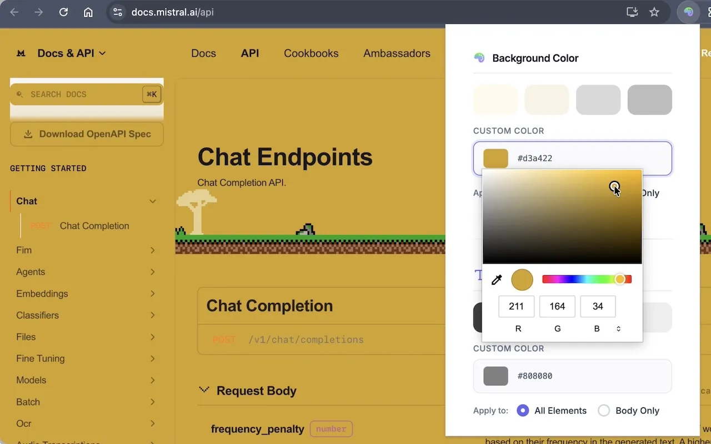
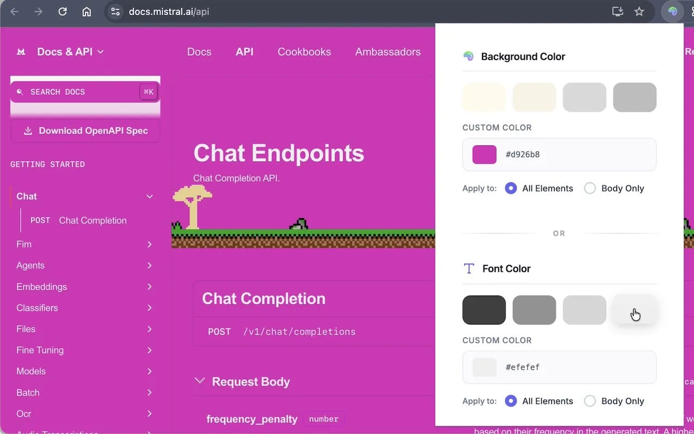

# Change Background Color

[![platform]][chrome-store] ![lang] ![mit]

> chrome extension to change the background color of current site

<table>
<tr>
<td></td>
<td></td>
</tr>
</table>

[mit]: https://img.shields.io/github/license/hoishing/multilingual-voice-search
[platform]: https://img.shields.io/badge/platform-chrome-red
[lang]: https://img.shields.io/badge/lang-javascript-yellow

- 📥 [Download @ Chrome Web Store][chrome-store]
- 🎬 [Video Demo](https://www.youtube.com/watch?v=oizbEM-QRhE)

## Motivation

Most color-changing extensions require the "read and change all your data on all site" permission, which is overkill and raises privacy concerns. This particular extension does only one thing: it changes the background/font color of the current site, that's all. No special permissions are required, no data is collected, opensource, no privacy concerns 🎉

# Updates

v2.0.0

- option to change background color of all elements or the body element only
- change font color
- UI overhaul

🔗 [source code](https://github.com/hoishing/chrome-change-background-color)

## ## Questions

- [Github issue]
- [LinkedIn]

[Github issue]: https://github.com/hoishing/change/issues
[LinkedIn]: https://www.linkedin.com/in/kng2
[chrome-store]: https://chrome.google.com/webstore/detail/change-background-color/ajlcblmihhjochfgehfcfiopkcbfnlfh
